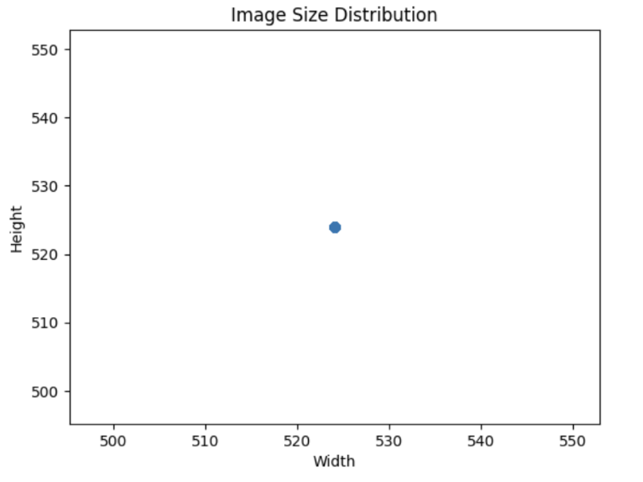

# Compost, Recycle, Trash Categorizer
## Introduction
Identifying whether trash can be recycled or composted can be a hassle as the state and material of the trash dictates what you can do with it. The goal of our project is to reduce this stress, and be able to classify an image of trash as recyclable, compostable, or landfill. By creating this model, clear images of trash can be classified to help us ensure we are disposing of waste properly and improving the environment. We chose this project due to its potential environmental impact by facilitating proper waste management practices. Having an accurate predictive model can assist in automating the sorting process, leading to more efficient recycling and waste distinction efforts. Additionally, the model can contribute to reducing contamination in recycling systems and promote sustainable practice.


## Methods

### Data Exploration
<a target="_blank" href="https://colab.research.google.com/drive/1ppVIFZKg99gVINq3GeW3XbGLlXQuLOnY?usp=sharing">
  
</a>

The RealWaste dataset comprises images of waste items collected from the Whyte's Gully Waste and Resource Recovery facility in Wollongong NSW, Australia.

The main goal was seeing what images we had and what their layout/size was. We first began by plotting the image sizes. Then we looked into the color distribution of different categories of trash the data set provided. Additionally, we looked into the number of images per each trash type. 

We also looked into whether there were any outliers in image size and label consistency. 

Our final step was displaying some randomly chosen images from each trash category and displaying them.

### Preprocessing
<a target="_blank" href="https://colab.research.google.com/drive/1KEcvWCYkV52NPyeS-_5xmDSmxJIV3ke8?usp=sharing">
  
</a>

We started by grouping the trash categories we were given via the dataset and grouping them as recycle, compost, or landfill. This grouped the images into 3 groups. 

To group these categories: Trash, recycle, compost guide: https://www.sandiego.gov/sites/default/files/cowr-guide-english.pdf 


The preprocessing implementation is shown before every colab moving forward. To refer to the code, look at the model 1 - 3 notebooks.


Other preprocessing we implemented was gray scaling and sizing down images before passing them into the model.


### Model 1 Convolutional Neural Network on Grayscale
<a target="_blank" href="https://colab.research.google.com/drive/1KEcvWCYkV52NPyeS-_5xmDSmxJIV3ke8?usp=sharing">
  
</a>

For our first model, we decided to preprocess the pictures by changing the image sizes to be 180 x 180 and by converting the pictures into grayscale images. After preprocessing, we built the model, creating a CCN that takes in an input shape of (180, 180, 1) and passes it through 3 convolution layers and dense layers. Here is the code for the model construction: 
```
model = models.Sequential()
model.add(layers.Resizing(180, 180, interpolation='bilinear', input_shape=(180, 180, 1)))
model.add(layers.Rescaling(1./255))
model.add(layers.Conv2D(64, (3, 3), activation='relu'))
model.add(layers.MaxPooling2D((2, 2)))
model.add(layers.Conv2D(128, (3, 3), activation='relu'))
model.add(layers.MaxPooling2D((2, 2)))
model.add(layers.Conv2D(256, (3, 3), activation='relu'))
model.add(layers.MaxPooling2D((2, 2)))
model.add(layers.Flatten())
model.add(layers.Dense(128, activation='relu'))
model.add(layers.Dense(64, activation='relu'))
model.add(layers.Dense(3, activation='softmax'))

```
We used the adam optimizer and  the categorical cross entropy loss function. 

The next step was splitting the data into training and testing datasets which we did by splitting the preprocessed images into an 80-20 training and testing split.

We then trained our model with the training data set for 1 epoch and batch size of 100. 

To test the model, we predicted the testing data and thresholded values to account for the one hot encoding. We then compared the predicted and actual for both the training and testing data. This gave us an accuracy and a sense of whether our model overfit or underfit. 


### Model 2 Deep Neural Network on RGB
<a target="_blank" href="https://colab.research.google.com/drive/11Fny_6xKCY2_ddIDxwC6iGdPsJowVTVW?usp=sharing">
  
</a>

Similar to the first model, we started by preprocessing our images, sizing them down to 180 by 180 and gray scaling them. 

Next we split the dataset into training, testing, and validation sets with a split of 90-5-5. 

Then we built the model by creating a DNN model that took in the images and flattened them so that they could be passed through the dense layers. Hyperparameter tuning was used to get the optimal parameters in the model. With the tuned parameters, the model was constructed as this:
```
model = models.Sequential()
  # preprocessing layers
  # model.add(layers.Resizing(180, 180, interpolation='bilinear', input_shape=(180, 180, 1)))
  # model.add(layers.Rescaling(1./255))
model.add(layers.Flatten(input_shape=(180, 180, 1)))
  # deep neural network layers
model.add(layers.Dense(units=481,
              activation='relu'))
model.add(layers.Dense(units=257,
              activation='sigmoid'))
model.add(layers.Dense(units=321,
              activation='softmax'))
model.add(layers.Dense(units=65,
              # Tune the activation function to use.
              activation='softmax'))
model.add(layers.Dense(units=449,
              # Tune the activation function to use.
              activation='tanh'))
model.add(layers.Dense(units=193,
              # Tune the activation function to use.
              activation='tanh'))
model.add(layers.Dense(3, activation='sigmoid'))  # Assuming 3 classes

```
The optimizer was set to be SGD and the loss function was set to categorical_crossentropy.

The model was trained using the training set and validated using the validation set. Then all 3 sets of data: training, validation, and testing, were used to generate predictions. Their accuracies and other metrics on the classification report were used to evaluate whether the model was overfitting or underfitting. 


### Model 3 K-Nearest Neighbors
<a target="_blank" href="https://colab.research.google.com/drive/1D1gvBfgVLAjMIjJTO7Bi0nL5cj_D9U8x?usp=sharing">
  
</a>

Our K-nearest neighbors model examines the RGB distances for each pixel. For the model, we preprocess image input into a flattened one-dimensional vector containing each original pixel's respective RGB values, so the dataframe contains observations of our images in which the features are these pixel values. The images will be classified based on the composition of RGB values. Our chosen parameter was k=11 neighbors as observed from multiple trials with different k values. In order to find a good k value, we ran multiple trials on the testing set to find the best accuracy of the first 30 k values.

#### Trials on testing set:
We plotted the accuracy for each value of k on a line graph, with the value of k as the x-axis and the accuracy on the y-axis.


## Results

### Data Exploration
The dataset is composed of the following labels and image counts:

- Cardboard: 461
- Food Organics: 411
- Glass: 420
- Metal: 790
- Miscellaneous Trash: 495
- Paper: 500
- Plastic: 921
- Textile Trash: 318
- Vegetation: 436

This is displayed in this figure:


The x-axis represents the types of waste that we have images of. The y-axis is the count of the amount of pictures that are categorized as that type of trash.

This was our results for the plotting the image sizes:



In the above visualization, we have the image size’s width as the x-axis and its height as the y-axis.

Clearly, the image sizes are uniform. 

For the color distribution among different trash categories this is what we found:


Our line graphs plots the RGB value of the image on the x-axis and its respective normalized frequency on the y-axis.

Data Quality and Anomalies:
- Outlier Detection: No outliers, such as unusually large or small images, have been detected in the dataset. Additionally, there are no black and white images present.
- Label Consistency: The labeling of waste categories appears to be consistent across the dataset, ensuring accuracy in classification tasks.

We found that potential preprocessing steps could be to use data transformation, normalization, and standardization methods and functions to better train our model to improve its accuracy.

Overall, the data sizes are uniform and there is a good amount of images per category.

For each category we displayed some of the images as shown by this example:


Refer to our notebook to see the whole figure.

### Preprocessing
Once we grouped the data as recycle, compost, and landfill we graphed the number of images per category. We used a bar graph with the the type of waste as the x-axis and the number of pictures as the y-axis, and got the following graph:


As seen in the figure, there are a lot more images that are recycling compared to the number of images for other categories.

This is what a sized down greyscale image looks like:


### Model 1 Convolutional Neural Network on Grayscale

Our model achieved an accuracy score of ~65%, which may seem better than randomly guessing. Upon futher examination, however, all the images are being classified as recycle, which is essentially random guessing. The reason why it isn't 33% (as there are 3 categories) is because there is a significantly larger number of recycle data compared to the compost and landfill.

```
train report:
               precision    recall  f1-score   support

           0       1.00      0.00      0.00       666
           1       1.00      0.00      0.00       653
           2       0.65      1.00      0.79      2482

   micro avg       0.65      0.65      0.65      3801
   macro avg       0.88      0.33      0.26      3801
weighted avg       0.77      0.65      0.52      3801
 samples avg       0.65      0.65      0.65      3801

test report:
               precision    recall  f1-score   support

           0       1.00      0.00      0.00       181
           1       1.00      0.00      0.00       160
           2       0.64      1.00      0.78       610

   micro avg       0.64      0.64      0.64       951
   macro avg       0.88      0.33      0.26       951
weighted avg       0.77      0.64      0.50       951
 samples avg       0.64      0.64      0.64       951

train accuracy: 0.6529860563009734
test accuracy: 0.6414300736067298
```
#### Training results:


#### Testing results:


### Model 2 Deep Neural Network on RGB
The 2nd model had an accuracy of about 64% for testing accuracy and a 65% accuracy in predicting the training data. For the validation sample, it had an accuracy of about 66% in predicting the validation targets. Given that the accuracy of the testing dataset is slightly less than the accuracy of the training and validation dataset, this suggests that the model slightly overfits.

From the DNN on RGB, we have an average accuracy of ~65%, we run into the same problem as model 1 for model 2, in which everything is being classified as recycle.

```
train report:
               precision    recall  f1-score   support

           0       1.00      0.00      0.00       755
           1       1.00      0.00      0.00       739
           2       0.65      1.00      0.79      2782

   micro avg       0.65      0.65      0.65      4276
   macro avg       0.88      0.33      0.26      4276
weighted avg       0.77      0.65      0.51      4276
 samples avg       0.65      0.65      0.65      4276

test report:
               precision    recall  f1-score   support

           0       1.00      0.00      0.00        46
           1       1.00      0.00      0.00        40
           2       0.64      1.00      0.78       152

   micro avg       0.64      0.64      0.64       238
   macro avg       0.88      0.33      0.26       238
weighted avg       0.77      0.64      0.50       238
 samples avg       0.64      0.64      0.64       238

validation report:
               precision    recall  f1-score   support

           0       1.00      0.00      0.00        46
           1       1.00      0.00      0.00        34
           2       0.66      1.00      0.80       158

   micro avg       0.66      0.66      0.66       238
   macro avg       0.89      0.33      0.27       238
weighted avg       0.78      0.66      0.53       238
 samples avg       0.66      0.66      0.66       238

train accuracy: 0.6506080449017774
test accuracy: 0.6386554621848739
validation accuracy: 0.6638655462184874
train logloss: 5.570141314261015
test logloss: 5.760693990080671
validation logloss: 5.358785123685643
```
#### Training results:


#### Testing results:


#### Validation results:


### Model 3 K-Nearest Neighbors
Our model performed with an accuracy of 70% on the testing set and 69% on the validation set with k=11 neighbors. This performed better than all the other models in terms of accuracy and the model was able to actually perform reasonable classification. As seen from the confusion matrices, some of the other categories are being classified correctly.

However, there is still a problem with too much bias for recycle classification, which is likely due to the disproportionate amount of recycle data due to the other data. We attempted to oversample to reduce the significance of the recycle data, but discovering the optimal k through multiple trials resulted in k=1 which is definitely overfitting.


#### Training results:
```
              precision    recall  f1-score   support

     compost       0.88      0.11      0.20       674
    landfill       0.62      0.30      0.40       665
     recycle       0.71      0.98      0.82      2462

    accuracy                           0.71      3801
   macro avg       0.74      0.46      0.47      3801
weighted avg       0.72      0.71      0.64      3801
```


#### Testing results:
```
              precision    recall  f1-score   support

     compost       0.83      0.06      0.11        82
    landfill       0.59      0.29      0.39        80
     recycle       0.71      0.97      0.82       314

    accuracy                           0.70       476
   macro avg       0.71      0.44      0.44       476
weighted avg       0.71      0.70      0.62       476
```

#### Validation results:
```
              precision    recall  f1-score   support

     compost       0.71      0.05      0.10        91
    landfill       0.48      0.15      0.22        68
     recycle       0.70      0.98      0.82       316

    accuracy                           0.69       475
   macro avg       0.63      0.40      0.38       475
weighted avg       0.67      0.69      0.59       475
```


## Discussion
### Data Exploration
In our study, we initiated our analysis with a thorough exploration of our waste dataset so we could understand the characteristics of the image sizing and labeling consistency. This would be essential to placing data into models more accurately. Additionally, we checked for category distribution to identify any potential biases that could affect our results.
### Preprocessing
Since we had many images that we wanted to pass through the model, we decided to size down the images. Additionally, to capture the shape as the primary indicator for predictions for our first two models, we converted the images to grayscale. Lastly, since the target was to predict whether an image of trash was to be recycled, composted, or thrown away, we split the images into these categories.
### Model 1	
 We implemented the Convolutional Neural Networks (CNNs) for our first model. CNNs are particularly known for working with image data, since they have the ability to detect edges and shapes effectively. However we believe that using grayscale for the images could have made some features harder to detect, possibly leading to our lower accuracy score. In addition, our CNN model demonstrated signs of underfitting, with both training and testing accuracies hovering around 0.6. 
### Model 2	
 For our second model, a Deep Neural Network (DNN), we kept the data, labels, and loss function consistent with the first model just to see if adding convolutional layers could help classify. Compared to our first model, the testing accuracy is slightly lower, suggesting that the first model was slightly better at predicting the trash type. Moreover, while the first model didn't overfit, the second model did slightly, as indicated by the log loss, where the test loss was larger than the training and validation loss. This suggests that there is a slight overfitting going on in the model.
### Model 3	
 We also explored the application of the K-Nearest Neighbors (KNN) algorithm since it would allow us to evaluate the distances between each image based on pixel values and enable us to identify similarities in color and shape and group similar images together. We hypothesized that categories with similarities, such as cardboard being brown, would exhibit clustering patterns. It had the best accuracy out of our models, so we tuned the KNN model with different simulations and varying values of K to optimize its performance and enhance the accuracy of our image classification. 

## Conclusion
For our project, we created and tested three different models. Our first two models, which utilized a convolutional neural network with grayscale images and a deep neural network with hyperparameter training, respectively, both achieved similar accuracy scores. Since the accuracy for both of these neural networks was about 0.6, we decided to use a different approach instead for our third model. This time, we used the k-nearest neighbors algorithm for our model. The algorithm used the RGB distances for each pixel to group images that have similar features together. Our reasoning behind this method was that similar images were likely to have alike colors as well. Our hypothesis proved to be correct as our third model was able to achieve a higher accuracy score of 0.7.

Overall, we believe that using k-nearest neighbors as our algorithm will generate the best model for our dataset due to how it groups images that look alike. However, there are likely other algorithms that could produce better results that we have yet to test. If we were to continue working on this project in the future, we could potentially try doing ensemble learning with our CNN and KNN models. Since both models did relatively well, we would probably produce better results if we combined those two models. Another classification algorithm we could utilize is SVMs. Since we have the labels of each feature as well as their features, we can classify the images using their RGB values and implement an SVM model.


## Collaboration
- Vibhuti Rajpurohit: Writer/Coder: worked on the second model and overall results, helped with final submission doc.

- Richa Kafle: Writer/Coder: Helped write readme for the milestones and helped write the models.

- Brandon Reponte: Writer/Coder: Implemented the 3rd model, K-nearest neighbors, for image classification, and aided in brainstorming our models.

- Esther Cho: Writer/Coder: wrote and coded the Data Exploration part with visuals, helped debug model 2, wrote discussion 

- Vanessa Hu: Writer/Coder: Worked on model 1 evaluation, wrote the conclusion

- Jared Simpauco: Writer/Coder: Worked on introduction, helped debug model 2, and helped debug data exploration

## Resources Citations: 
Dataset: Single S, Iranmanesh S, Raad R. RealWaste: A Novel Real-Life Data Set for Landfill Waste Classification Using Deep Learning. Information. 2023; 14(12):633. https://doi.org/10.3390/info14120633

# Previous Milestones

## Milestone 4: Model 2 and Evaluation
<a target="_blank" href="https://colab.research.google.com/drive/11Fny_6xKCY2_ddIDxwC6iGdPsJowVTVW?usp=sharing">
  
</a>

### Model Evaluation
There were no changes made to the data, labels, and loss function as they were sufficient for our 2nd model.
The 2nd model had an accuracy of about 64% for testing accuracy and a 65% accuracy in predicting the training data. For the validation sample, it had an accuracy of about 66% in predicting the validation targets. Given that the accuracy of the testing dataset is slightly less than the accuracy of the training and validation dataset, this suggests that the model slightly overfits. 
Compared to our first model, the testing accuracy is slightly lower than the 1st model's suggesting that the first model was slighly better at predicting the trash type. In the first model, it was found that the data didn't overfit while the second does sligthly. 
As for error, we looked at the log loss which inicated that the test loss was larger than the training and validation loss suggesting that there is a slight overfitting going on in the model.
### Results of Hyper Parameter Tuning
We did hyperparameter tuning to find the optimal parameters for the model. Through this, we were able to get better parameters for our deep neural network to better predict the trash type. This allowed us to know the best number of units and activation functions for each layer. It also let us see the best learning rate and loss function. 
### Next Model
For the next model, we are thinking of using a k-nearest neighbors model that examines the rgb distances for each pixel. We chose this model since it allows us to group images that have similar features and classify them as one of the three trash types. We intend to approach the model by processing image input into a flattened one-dimensional vector in which every 3 values in the vector represent the respective rgb values for each pixel in the original message. With this model, we anticipate that the images will be classified based on the composition of rgb values, with images of similar colors being more related.
### Conclusion
Overall, for image data, a deep neural network isn't the best type of model to clasify as seen by how the testing accuracy was higher in our first CCN model as opposed to our second model which is a deep neural network. This suggests that adding some convolution layers could be helpfull in better predicting the trash type. 


## Milestone 3: Preprocessing 
<a target="_blank" href="https://colab.research.google.com/drive/1KEcvWCYkV52NPyeS-_5xmDSmxJIV3ke8?usp=sharing">
  
</a>

### Model evaluation
For our model, we decided to preprocess the pictures by changing the image sizes to be 180 x 180 and by converting the pictures into greyscaled images. After preprocessing the images, we trained our model with the new data and achieved an accuracy score of 0.63. Although this score is better than the score attained by randomly guessing, we hope to improve our model by having the images colored instead. We believe that using greyscale for the images could have made some features harder to detect, possibly leading to our lower accuracy score. Since both the training and testing accuracies are lower, being around 0.6, the model does underfit. 
### 2 New Models
- For one model, we will try having separate channels so that the colors can be considered in the model since greyscaling may have caused the accuracy to go down
- For the second, we will try changing the activation functions of the layers to see which one is optimal in minimizing the loss. Additionally, altering the units of the layer to better categorize the trash. This is to tweak the model to be better fitting


## Milestone 2: Data Expoloration
<a target="_blank" href="https://colab.research.google.com/drive/1ppVIFZKg99gVINq3GeW3XbGLlXQuLOnY?usp=sharing">
  
</a>

 ### Preprocessing
 Some steps we have taken and will take in the future is checking whether the image sizes are uniform. They are uniform in this data set so making them uniform is not needed. We also check for outliers such as much larger or smaller images or black and white images. None of these were found. All images are uniformally sized and in color. In our data there is a category of miscellaneous trash. For this, potential preprocessing steps could be to use data transformation, normalization, and stadardization methods and functions to better train our model to improve its accuracy. Additionally, the data has 9 categories right now, so these categories need to be grouped together depending on whether they are recyclable, compostable, or landfill. For this task we have this source to help decide how to group these categories:
Trash, recycle, compost guide: https://www.sandiego.gov/sites/default/files/cowr-guide-english.pdf

# RealWaste Dataset

RealWaste is an image dataset assembled from waste material received at the Whyte's Gully Waste and Resource Recovery facility in Wollongong NSW Australia.

If you use our dataset in your work, please cite our original work: [RealWaste: A Novel Real-Life Data Set for Landfill Waste Classification Using Deep Learning](https://www.mdpi.com/2078-2489/14/12/633).

Please note, this dataset is licenced under CC BY-NC-SA 4.0.

The dataset is composed of the following labels and image counts:
  - Cardboard: 461
  - Food Organics: 411
  - Glass: 420
  - Metal: 790
  - Miscellaneous Trash: 495
  - Paper: 500
  - Plastic: 921
  - Textile Trash: 318
  - Vegetation: 436

The above labelling may be further subdivided as required, i.e., Transparent Plastic, Opaque Plastic.
Trash, recycle, compost guide: https://www.sandiego.gov/sites/default/files/cowr-guide-english.pdf
